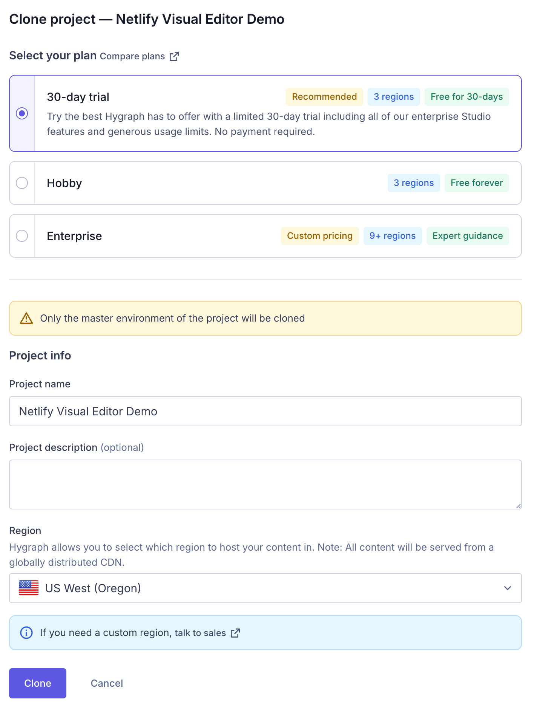
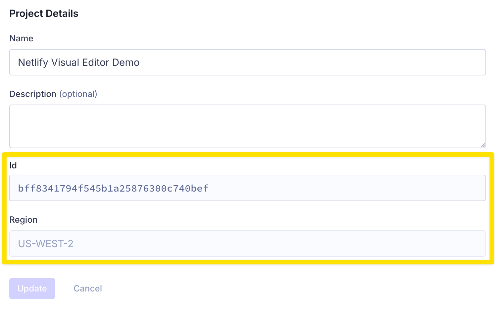
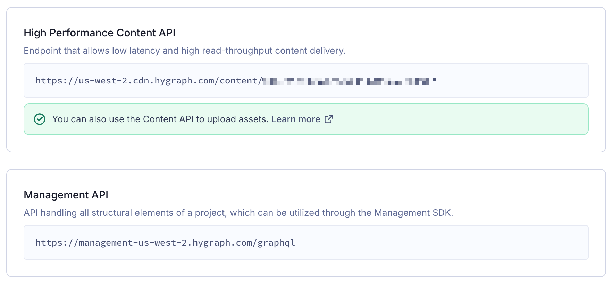
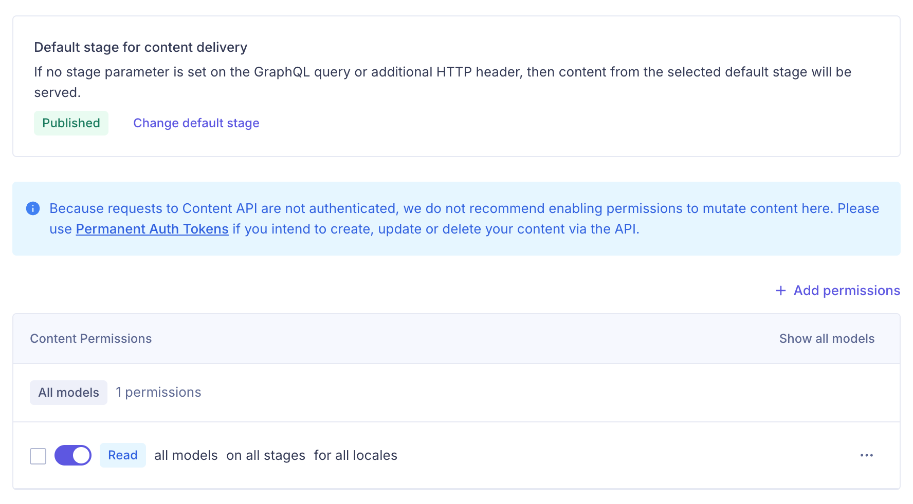
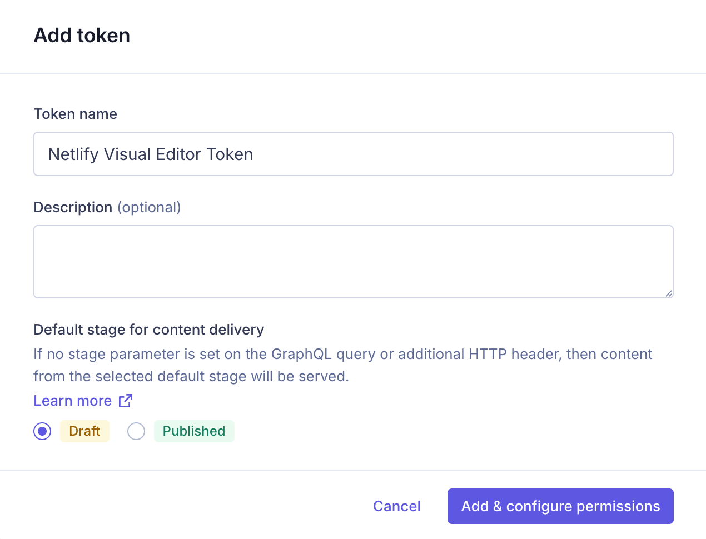
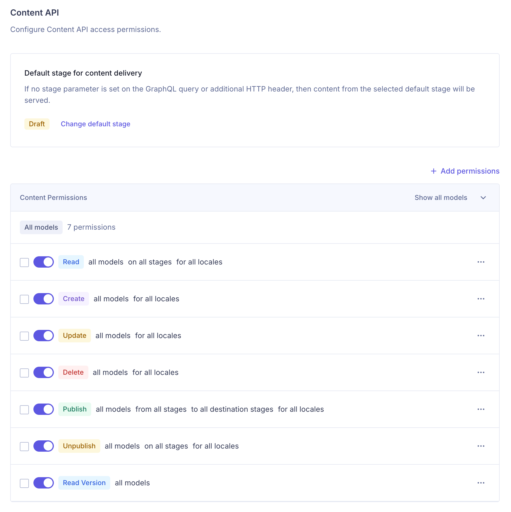
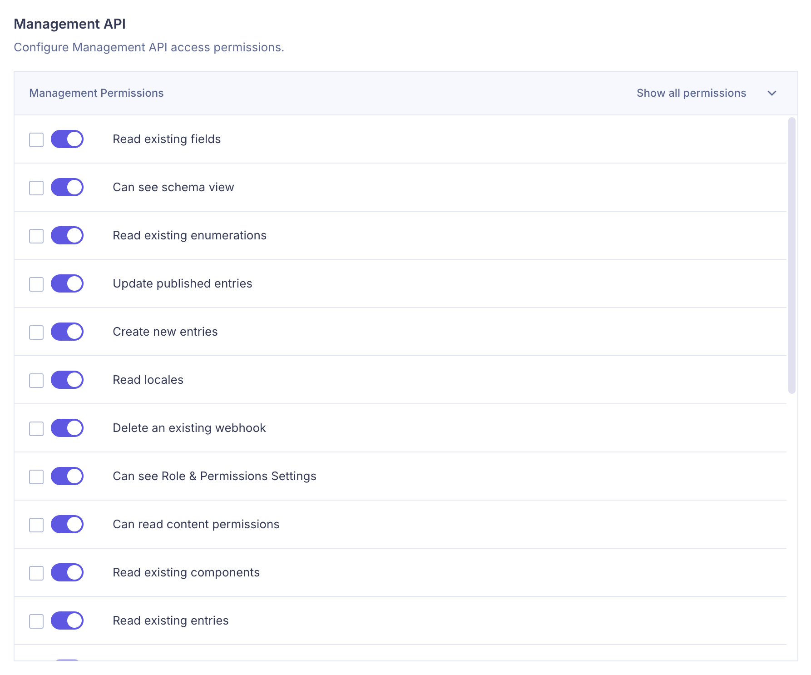
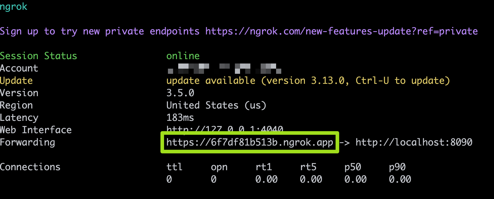

This is a Netlify Visual Editor starter project based on Next.js, Flowbite, and Hygraph.

## Getting Started

1. Clone this repo.

2. Install dependencies in the project's root folder. Make sure to be on Node.js version 18 or higher.

   ```bash
   npm install
   ```

3. Copy `.env.example` to `.env`. In the following steps you are going to fill in the values of the variables in the `.env`.

   ```bash
   cp .env.example .env)
   ```

   1. `HYGRAPH_PROJECT_ID`: Hygraph project ID.
   2. `HYGRAPH_REGION`: Hygraph project region.
   3. `HYGRAPH_ENVIRONMENT`: Hygraph project environment (default: `master`).
   4. `HYGRAPH_ENDPOINT`: Hygraph content API endpoint URL.
   5. `HYGRAPH_MANAGEMENT_API`: Hygraph management API endpoint URL.
   6. `HYGRAPH_MANAGEMENT_TOKEN`: Hygraph management token.

4. [Clone the Netlify Visual Editor Demo](https://app.hygraph.com/clone/44fc203882f6401cb21af769923a5123?name=Netlify%20Visual%20Editor%20Demo) project in Hygraph.

   <p align="center"></p>

5. Navigate to the main project settings page, copy the project **Id** and the **Region** values and set them to the `HYGRAPH_PROJECT_ID` and the `HYGRAPH_REGION` variables respectively in your `.env` file.

   <p align="center"></p>

6. Navigate to the "**Endpoints**" section in the project settings, copy the "**High Performance Content API**" and the "**Management API**" values and set them to the `HYGRAPH_ENDPOINT` and the `HYGRAPH_MANAGEMENT_API` variables respectively in your `.env` file.

   <p align="center"></p>

7. Navigate to "**Content API**" section and add "**Read**" permission for all models, all stages and all locales.

   <p align="center"></p>

8. Navigate to “Permanent Auth Tokens” section and create a new token. Copy the token value and set it to the `HYGRAPH_MANAGEMENT_TOKEN` variable in your `.env` file.

   <p align="center"></p>

9. The token should have the following configuration:

   - Content API section:
     - Default stage for content delivery: **Draft**
     - Content permissions enabled for all models, all stages and all locales
     
     <p align="center"></p>

   - Management API - The management API should include 21 permissions:
   
     1. Read existing environments
     2. Read existing models
     3. Read existing components
     4. Read existing fields
     5. Read existing enumerations
     6. Read existing entries
     7. Read remote sources
     8. Read stages
     9. Read locales
     10. Can see schema view
     11. Update existing non-published entries
     12. Update published entries
     13. Publish non-published entries
     14. Create new entries
     15. Delete existing entries
     16. Create new webhooks
     17. Read existing webhooks
     18. Update existing webhooks
     19. Delete an existing webhook
     20. Can see Role & Permissions Settings
     21. Can read content permissions
     22. (Optional for debugging) Can use the playground

     <p align="center"></p>

10. Run `npm run dev` to start the Next.js development server. This will start a local dev server on http://localhost:3000. Open it in your browser and validate that the site is working properly and renders the content from Hygraph. Try updating some content in Hygraph, then reload the page to see the changes. Keep this terminal window opened and the dev server running.

11. To enable automatic content updates in the Visual Editor when working locally, you can use webhooks and tunnel them to your local machine using a tool like [ngrok](https://ngrok.com/). To do so, open a second terminal and run `ngrok http 8090`. If you don’t have ngrok, please follow ngrok’s [quick start guide](https://ngrok.com/docs/getting-started/) to install it. Once ngrok has started it will print a public URL in the form of [https://xyz.ngrok.app](https://xyz.ngrok.app/) or [https://xyz.ngrok.io](https://xyz.ngrok.io/). Keep this terminal window opened and the ngrok running.

   <p align="center"></p>

12. Open a third terminal window and install Visual Editor CLI:

   ```bash
   npm i -g @stackbit/cli
   ```

13. Run `stackbit dev` with `--csi-webhook-url` argument set to your ngrok's public URL address ending with the `/_stackbit/onWebhook` path:

    ```bash
    stackbit dev --csi-webhook-url=https://<REPLACE>.ngrok.app/_stackbit/onWebhook
    ```

14. Once `stackbit dev` starts, click the http://localhost:8090/_stackbit link printed in terminal to open the visual editor.
